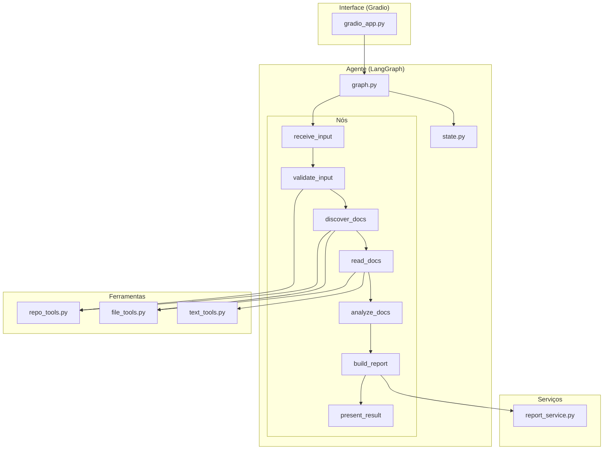
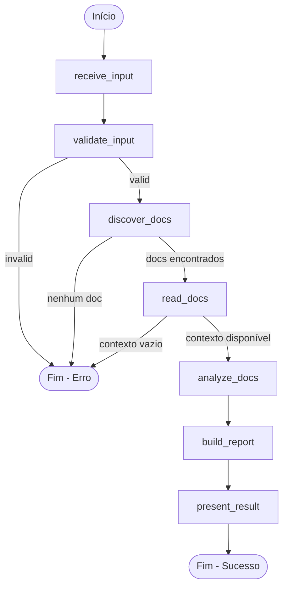

# Design Document — Agente de Análise de Documentação de Software

## Overview

Este documento descreve o design técnico do **Agente de Análise de Documentação de Software**, um sistema baseado em LangGraph que automatiza a avaliação de qualidade de documentação técnica de projetos de software.

O agente recebe como entrada uma URL de repositório Git ou arquivos Markdown enviados localmente, localiza documentos relevantes (README, PRD), lê e normaliza seu conteúdo, realiza análise multidimensional (clareza, cobertura, consistência e onboarding), e gera um relatório estruturado em Markdown com diagnóstico, nota qualitativa e recomendações.

### Decisões de Design Principais

1. **LangGraph como orquestrador**: O fluxo é modelado como um grafo direcionado acíclico (DAG) com 7 nós sequenciais, permitindo interrupção precoce em caso de erro e preservação do estado parcial.
2. **Estado tipado compartilhado**: Um `TypedDict` centraliza todos os dados do fluxo, garantindo tipagem estática e propagação controlada entre nós.
3. **Ferramentas desacopladas**: Funções utilitárias são independentes do grafo e testáveis isoladamente.
4. **Interface Gradio como camada fina**: A UI apenas invoca o agente e renderiza resultados, sem lógica de negócio.

---

## Architecture

### Diagrama de Arquitetura



### Diagrama de Fluxo do Grafo



### Direção de Dependência

```
app/ui/ → app/agent/ → app/tools/
                      → app/services/
```

- `app/ui/` depende de `app/agent/` (invoca o grafo)
- `app/agent/` depende de `app/tools/` e `app/services/` (usa ferramentas)
- Nenhuma dependência circular é permitida
- `app/tools/` e `app/services/` são módulos independentes entre si

---

## Components and Interfaces

### 1. Interface — `app/ui/gradio_app.py`

**Responsabilidade**: Expor o agente ao usuário via interface web Gradio.

```python
def create_app() -> gr.Blocks:
    """Cria e retorna a aplicação Gradio configurada."""
    ...

def handle_submission(url: str | None, files: list[str] | None) -> str:
    """
    Callback principal: valida modo de entrada,
    invoca o agente e retorna o resultado renderizado.
    
    Args:
        url: URL do repositório Git (ou None)
        files: Lista de caminhos de arquivos enviados (ou None)
    
    Returns:
        Relatório em Markdown ou mensagem de erro.
    
    Raises:
        TimeoutError: Se o processamento exceder 120 segundos.
    """
    ...
```

**Contrato**:
- Recebe entrada do usuário (URL ou arquivos)
- Valida exclusividade de modo (apenas URL ou apenas arquivos)
- Invoca `run_agent()` com a entrada bruta
- Exibe resultado ou erro na área de saída
- Gerencia indicador de carregamento e timeout de 120s

---

### 2. Grafo do Agente — `app/agent/graph.py`

**Responsabilidade**: Definir e compilar o grafo LangGraph.

```python
def build_graph() -> CompiledGraph:
    """Constrói e compila o grafo LangGraph com todos os nós e arestas."""
    ...

def run_agent(raw_input: str, input_type: str) -> AgentState:
    """
    Executa o grafo completo e retorna o estado final.
    
    Args:
        raw_input: Entrada bruta do usuário (URL ou caminhos de arquivos)
        input_type: Tipo de entrada ("repository" ou "local_files")
    
    Returns:
        Estado final do agente com todos os campos preenchidos.
    """
    ...
```

**Roteamento condicional**:
- Após `validate_input`: se `validation_status == "invalid"` → fim
- Após `discover_docs`: se `discovered_files` vazio → fim
- Após `read_docs`: se `merged_context` vazio → fim

---

### 3. Estado — `app/agent/state.py`

**Responsabilidade**: Definir a estrutura tipada do estado compartilhado.

```python
from typing import TypedDict

class ErrorEntry(TypedDict):
    node: str
    message: str

class AgentState(TypedDict):
    raw_input: str
    input_type: str
    validation_status: str
    validation_message: str
    repository_url: str | None
    local_files: list[str]
    discovered_files: list[str]
    readme_content: str | None
    prd_content: str | None
    merged_context: str | None
    analysis_result: dict | None
    final_report: str | None
    errors: list[ErrorEntry]
```

---

### 4. Nós do Grafo — `app/agent/nodes/`

Cada nó é uma função pura que recebe o `AgentState` e retorna um dicionário parcial com os campos que atualiza.

#### `receive_input.py`
```python
def receive_input(state: AgentState) -> dict:
    """Registra a entrada bruta e o tipo no estado."""
    ...
```
**Campos que escreve**: `raw_input`, `input_type`

#### `validate_input.py`
```python
def validate_input(state: AgentState) -> dict:
    """Valida a entrada conforme tipo e registra resultado."""
    ...
```
**Campos que escreve**: `validation_status`, `validation_message`, `repository_url`, `local_files`

#### `discover_docs.py`
```python
def discover_docs(state: AgentState) -> dict:
    """Localiza documentos relevantes no repositório ou arquivos locais."""
    ...
```
**Campos que escreve**: `discovered_files`

#### `read_docs.py`
```python
def read_docs(state: AgentState) -> dict:
    """Lê e normaliza o conteúdo dos documentos descobertos."""
    ...
```
**Campos que escreve**: `readme_content`, `prd_content`, `merged_context`

#### `analyze_docs.py`
```python
def analyze_docs(state: AgentState) -> dict:
    """Analisa o contexto consolidado e gera o resultado estruturado."""
    ...
```
**Campos que escreve**: `analysis_result`

#### `build_report.py`
```python
def build_report(state: AgentState) -> dict:
    """Gera o relatório Markdown final a partir do resultado da análise."""
    ...
```
**Campos que escreve**: `final_report`

#### `present_result.py`
```python
def present_result(state: AgentState) -> dict:
    """Nó terminal que sinaliza conclusão do fluxo."""
    ...
```
**Campos que escreve**: nenhum (nó de saída)

---

### 5. Ferramentas — `app/tools/`

#### `repo_tools.py`
```python
def validate_repository_url(url: str) -> tuple[bool, str]:
    """
    Valida sintaxe e acessibilidade da URL do repositório.
    
    Args:
        url: URL candidata a repositório Git.
    
    Returns:
        Tupla (is_valid, message) onde message descreve o resultado.
    
    Timeout: 30 segundos para verificação de acessibilidade.
    """
    ...

def clone_or_open_repository(url: str, target_dir: str) -> str:
    """
    Clona o repositório remoto ou abre se já existir localmente.
    
    Args:
        url: URL do repositório Git.
        target_dir: Diretório destino para clonagem.
    
    Returns:
        Caminho absoluto do diretório do repositório.
    
    Raises:
        TimeoutError: Se a clonagem exceder 60 segundos.
        GitCommandError: Se a clonagem falhar.
    """
    ...
```

#### `file_tools.py`
```python
PRIORITY_PATTERNS: list[str] = [
    "README.md", "PRD.md", "docs/README.md",
    "product_requirements.md", "docs/prd.md"
]

def find_documentation_files(root_path: str, max_files: int = 5) -> list[str]:
    """
    Busca documentos Markdown relevantes seguindo ordem de prioridade.
    
    Args:
        root_path: Raiz do repositório ou diretório de busca.
        max_files: Número máximo de arquivos a retornar.
    
    Returns:
        Lista de caminhos absolutos dos arquivos encontrados.
    """
    ...

def read_markdown_file(
    file_path: str, 
    max_size_bytes: int = 1_048_576,
    fallback_encoding: str = "latin-1"
) -> tuple[str | None, str | None]:
    """
    Lê um arquivo Markdown com limite de tamanho e fallback de encoding.
    
    Args:
        file_path: Caminho absoluto do arquivo.
        max_size_bytes: Limite de tamanho (padrão: 1 MB).
        fallback_encoding: Encoding alternativo se UTF-8 falhar.
    
    Returns:
        Tupla (content, error) onde content é o texto ou None,
        e error é a mensagem de erro ou None.
    """
    ...
```

#### `text_tools.py`
```python
def normalize_document_text(text: str) -> str:
    """
    Normaliza texto Markdown: remove linhas em branco consecutivas,
    trim de espaços e garante UTF-8.
    
    Args:
        text: Texto bruto do documento.
    
    Returns:
        Texto normalizado.
    """
    ...
```

---

### 6. Serviços — `app/services/report_service.py`

```python
def generate_report_markdown(analysis_result: dict, files_analyzed: list[str]) -> str:
    """
    Gera o relatório Markdown estruturado a partir do resultado da análise.
    
    Args:
        analysis_result: Dicionário com resultado estruturado da análise.
        files_analyzed: Lista de caminhos relativos dos arquivos analisados.
    
    Returns:
        String com o relatório completo em formato Markdown.
    
    Seções geradas:
        - Resumo Executivo
        - Escopo Identificado
        - Pontos Fortes
        - Problemas Encontrados
        - Checklist de Melhorias
        - Nota Qualitativa
        - Limitações da Análise
    """
    ...
```

---

## Data Models

### Estado do Agente (`AgentState`)

| Campo | Tipo | Valor Padrão | Descrito por Nó |
|-------|------|--------------|-----------------|
| `raw_input` | `str` | `""` | `receive_input` |
| `input_type` | `str` | `""` | `receive_input` |
| `validation_status` | `str` | `""` | `validate_input` |
| `validation_message` | `str` | `""` | `validate_input` |
| `repository_url` | `str \| None` | `None` | `validate_input` |
| `local_files` | `list[str]` | `[]` | `validate_input` |
| `discovered_files` | `list[str]` | `[]` | `discover_docs` |
| `readme_content` | `str \| None` | `None` | `read_docs` |
| `prd_content` | `str \| None` | `None` | `read_docs` |
| `merged_context` | `str \| None` | `None` | `read_docs` |
| `analysis_result` | `dict \| None` | `None` | `analyze_docs` |
| `final_report` | `str \| None` | `None` | `build_report` |
| `errors` | `list[ErrorEntry]` | `[]` | qualquer nó |

### Estrutura de `analysis_result`

```python
{
    "dimensoes": {
        "clareza": {"avaliacao": str, "status": "avaliado" | "nao_avaliavel"},
        "cobertura": {"avaliacao": str, "status": "avaliado" | "nao_avaliavel"},
        "consistencia": {"avaliacao": str, "status": "avaliado" | "nao_avaliavel"},
        "onboarding": {"avaliacao": str, "status": "avaliado" | "nao_avaliavel"},
    },
    "pontos_fortes": [str],          # 1-10 itens, cada um com até 280 chars
    "problemas": [
        {"tipo": "observacao" | "recomendacao", "descricao": str}
    ],                                 # 1-15 itens
    "nota": {
        "valor": int,                  # 0-10
        "justificativa": str           # mínimo 2 frases
    },
    "limitacoes": [str],
    "base_insuficiente": bool          # True se merged_context < 100 chars
}
```

### Estrutura de `ErrorEntry`

```python
{
    "node": str,     # Nome do nó que gerou o erro
    "message": str   # Descrição legível do erro
}
```

### Seções do Relatório Final

O `final_report` é uma string Markdown com as seguintes seções (nesta ordem):

1. `## Resumo Executivo` — Síntese da análise com nome do projeto e documentos avaliados
2. `## Escopo Identificado` — Arquivos analisados com caminhos relativos
3. `## Pontos Fortes` — Lista dos aspectos positivos identificados
4. `## Problemas Encontrados` — Itens classificados como observação ou recomendação
5. `## Checklist de Melhorias` — Lista de ações sugeridas em formato de checklist
6. `## Nota Qualitativa` — Nota numérica (0-10) com justificativa textual
7. `## Limitações da Análise` — Restrições e ressalvas da avaliação realizada


---

## Correctness Properties

*Uma propriedade é uma característica ou comportamento que deve ser verdadeiro em todas as execuções válidas de um sistema — essencialmente, uma declaração formal sobre o que o sistema deve fazer. Propriedades servem como ponte entre especificações legíveis por humanos e garantias de corretude verificáveis por máquina.*

### Property 1: Registro correto de entrada no estado

*Para qualquer* entrada válida (URL de repositório ou lista de arquivos), o nó `receive_input` SHALL registrar `raw_input` com o valor da entrada e `input_type` com `"repository"` (se URL) ou `"local_files"` (se arquivos), sem alterar nenhum outro campo do estado.

**Validates: Requirements 1.2, 1.3**

### Property 2: Validação sintática de URL rejeita formatos inválidos

*Para qualquer* string que não possua esquema `http://` ou `https://` seguido de host válido, a função `validate_repository_url` SHALL retornar `(False, mensagem_de_erro)` e o Validador SHALL definir `validation_status` como `"invalid"`.

**Validates: Requirements 2.1, 2.4**

### Property 3: Validação de extensão de arquivo aceita apenas .md e .markdown

*Para qualquer* lista de nomes de arquivo, o Validador SHALL aceitar (validation_status = "valid") apenas quando pelo menos um arquivo possui extensão `.md` ou `.markdown`, e SHALL rejeitar (validation_status = "invalid") quando nenhum arquivo possui extensão suportada.

**Validates: Requirements 2.2, 2.6, 2.7**

### Property 4: Descoberta de documentos respeita ordem de prioridade e deduplicação

*Para qualquer* árvore de diretórios contendo arquivos Markdown, `find_documentation_files` SHALL retornar arquivos ordenados pela prioridade definida (README.md > PRD.md > docs/README.md > product_requirements.md > docs/prd.md), limitados a no máximo 5 resultados, e sem duplicatas case-insensitive (mantendo apenas a primeira ocorrência).

**Validates: Requirements 3.1, 3.3, 3.5**

### Property 5: Normalização de texto é idempotente

*Para qualquer* string de texto Markdown, aplicar `normalize_document_text` duas vezes SHALL produzir o mesmo resultado que aplicar uma vez (idempotência). Adicionalmente, o resultado SHALL não conter mais de uma linha em branco consecutiva e SHALL não ter espaços em início ou fim de cada linha.

**Validates: Requirements 4.2, 4.3**

### Property 6: Contexto consolidado preserva todo conteúdo com rastreabilidade

*Para qualquer* conjunto de documentos lidos com sucesso, `merged_context` SHALL conter o conteúdo normalizado de cada documento precedido por um cabeçalho com o caminho relativo do arquivo de origem, e o comprimento total SHALL ser maior ou igual à soma dos comprimentos dos conteúdos individuais normalizados.

**Validates: Requirements 4.4**

### Property 7: Limites de leitura são respeitados

*Para qualquer* lista de `discovered_files`, o Leitor SHALL processar no máximo 20 arquivos e SHALL ignorar (sem incluir no `merged_context`) arquivos cujo tamanho exceda 1 MB, registrando erro para cada arquivo ignorado.

**Validates: Requirements 4.1, 4.5**

### Property 8: Resultado da análise respeita invariantes estruturais

*Para qualquer* execução bem-sucedida do Analisador, `analysis_result` SHALL conter: `dimensoes` com exatamente 4 chaves (clareza, cobertura, consistência, onboarding), `pontos_fortes` com 1 a 10 itens (cada um com no máximo 280 caracteres), `problemas` com 1 a 15 itens (cada um classificado como "observacao" ou "recomendacao"), `nota.valor` como inteiro de 0 a 10, e `nota.justificativa` com no mínimo 2 frases.

**Validates: Requirements 5.2, 5.3, 5.4, 5.5**

### Property 9: Base documental insuficiente limita a nota máxima

*Para qualquer* `merged_context` com menos de 100 caracteres, o Analisador SHALL definir `base_insuficiente` como True e atribuir `nota.valor` no máximo 3.

**Validates: Requirements 5.6**

### Property 10: Relatório gerado contém todas as seções na ordem correta

*Para qualquer* `analysis_result` válido e lista de arquivos analisados, `generate_report_markdown` SHALL produzir um relatório contendo exatamente as 7 seções obrigatórias (Resumo Executivo, Escopo Identificado, Pontos Fortes, Problemas Encontrados, Checklist de Melhorias, Nota Qualitativa, Limitações da Análise) como headings `##` na ordem especificada, incluindo nota numérica 0-10, todas as limitações registradas, e o caminho relativo de cada arquivo analisado.

**Validates: Requirements 6.1, 6.2, 6.3, 6.4**

### Property 11: Isolamento de campos entre nós

*Para qualquer* execução de um nó do grafo, apenas os campos designados àquele nó (conforme mapeamento definido no Requirement 8.2) SHALL ser alterados, e todos os demais campos SHALL permanecer inalterados.

**Validates: Requirements 8.2**

### Property 12: Preservação de estado em caso de erro

*Para qualquer* erro irrecuperável em qualquer nó, o Agente SHALL preservar todos os campos já preenchidos por nós anteriores, adicionar uma entrada ao campo `errors` com `node` e `message` preenchidos, e não executar nós subsequentes.

**Validates: Requirements 8.4, 8.5**

### Property 13: Credenciais nunca são expostas na saída

*Para qualquer* estado contendo variáveis de ambiente com padrões `KEY`, `SECRET`, `TOKEN` ou `PASSWORD`, o `final_report` e as mensagens em `errors` SHALL não conter os valores dessas variáveis.

**Validates: Requirements 10.3**

---

## Error Handling

### Estratégia de Tratamento de Erros

O sistema adota uma abordagem de **falha segura e explicável**, onde cada nó do grafo é responsável por capturar erros locais e registrá-los no estado antes de decidir se o fluxo pode continuar.

### Categorias de Erro

| Categoria | Exemplo | Ação | Recuperável? |
|-----------|---------|------|--------------|
| Entrada inválida | URL malformada, arquivo sem extensão .md | Registrar em `errors`, encerrar fluxo | Não |
| Falha de rede | Timeout na clonagem, repositório inacessível | Registrar em `errors`, limpar temp, encerrar | Não |
| Falha de leitura | Permissão negada, encoding inválido | Registrar em `errors`, continuar com restantes | Sim |
| Documentação ausente | Nenhum .md encontrado | Registrar em `errors`, encerrar fluxo | Não |
| Contexto vazio | Nenhum arquivo lido com sucesso | Registrar em `errors`, encerrar fluxo | Não |
| Análise parcial | Dimensão sem conteúdo suficiente | Marcar como "nao_avaliavel", continuar | Sim |
| Timeout geral | Processamento > 120s (UI) ou operação > 60s | Cancelar operação, registrar timeout | Não |
| Exceção não tratada | Qualquer exceção inesperada | Capturar, registrar, preservar estado, encerrar | Não |

### Padrão de Tratamento por Nó

```python
def node_function(state: AgentState) -> dict:
    try:
        # Lógica do nó
        result = process(state)
        return {"campo_designado": result}
    except SpecificError as e:
        return {
            "errors": state["errors"] + [
                {"node": "node_name", "message": str(e)}
            ]
        }
```

### Propagação de Erros no Grafo

- **Erros irrecuperáveis**: O roteamento condicional do LangGraph detecta o erro (via campo `errors` ou `validation_status`) e dirige o fluxo para o nó terminal, pulando nós intermediários.
- **Erros recuperáveis**: O nó registra o erro mas produz saída parcial, permitindo que o fluxo continue.
- **Estado parcial**: Em qualquer terminação por erro, o estado é retornado com todos os campos acumulados até o ponto de falha.

### Timeouts

| Operação | Limite | Ação após timeout |
|----------|--------|-------------------|
| Verificação de URL (acessibilidade) | 30s | Retornar invalid |
| Clonagem de repositório | 60s | Cancelar, limpar temp, registrar erro |
| Leitura de arquivo individual | 60s | Registrar erro, continuar |
| Processamento total (UI) | 120s | Encerrar, exibir mensagem de timeout |

### Limpeza de Recursos

- Diretórios temporários criados para clonagem SHALL ser removidos em caso de falha.
- Utilizar `tempfile.TemporaryDirectory` com context manager para garantir limpeza automática.
- Em caso de timeout ou exceção, o bloco `finally` garante a remoção.

---

## Testing Strategy

### Abordagem Dual de Testes

O projeto utiliza uma combinação de **testes unitários** (exemplos e edge cases) e **testes baseados em propriedades** (validação universal) para cobertura abrangente.

### Biblioteca de Testes

- **Framework**: `pytest`
- **Property-based testing**: `hypothesis` (Python)
- **Mocking**: `unittest.mock` e `pytest-monkeypatch`
- **Cobertura**: `pytest-cov`

### Testes Baseados em Propriedades (PBT)

Cada propriedade definida na seção Correctness Properties será implementada como um teste usando `hypothesis`:

- **Mínimo 100 iterações por teste** (configurado via `@settings(max_examples=100)`)
- **Tag**: Cada teste incluirá um comentário referenciando a propriedade:
  ```python
  # Feature: doc-intelligence-agent, Property 1: Registro correto de entrada no estado
  ```

#### Mapeamento de Propriedades para Testes

| Propriedade | Arquivo de Teste | Gerador Principal |
|-------------|-----------------|-------------------|
| 1: Registro de entrada | `tests/test_receive_input.py` | URLs e listas de caminhos aleatórios |
| 2: Validação de URL | `tests/test_validation.py` | Strings aleatórias com/sem formato de URL |
| 3: Validação de extensão | `tests/test_validation.py` | Listas de nomes de arquivo com extensões variadas |
| 4: Descoberta com prioridade | `tests/test_discovery.py` | Árvores de diretório simuladas |
| 5: Normalização idempotente | `tests/test_text_tools.py` | Strings Markdown aleatórias |
| 6: Contexto consolidado | `tests/test_read_docs.py` | Conjuntos de documentos simulados |
| 7: Limites de leitura | `tests/test_read_docs.py` | Listas de arquivos com tamanhos variados |
| 8: Estrutura do analysis_result | `tests/test_analysis.py` | Dicionários de resultado gerados |
| 9: Base insuficiente | `tests/test_analysis.py` | Strings com < 100 caracteres |
| 10: Estrutura do relatório | `tests/test_report.py` | Dicionários analysis_result válidos |
| 11: Isolamento de campos | `tests/test_state.py` | Estados iniciais + execuções de nós |
| 12: Preservação em erro | `tests/test_state.py` | Erros injetados em vários nós |
| 13: Filtragem de credenciais | `tests/test_security.py` | Estados com variáveis sensíveis |

### Testes Unitários (Exemplos e Edge Cases)

| Módulo | Testes | Tipo |
|--------|--------|------|
| `tests/test_validation.py` | Entrada vazia, ambos campos preenchidos, URL acessível/inacessível | Edge case + Integration |
| `tests/test_discovery.py` | Repositório sem .md, caminhos inexistentes, erros de clonagem | Edge case |
| `tests/test_read_docs.py` | Arquivo > 1MB, encoding Latin-1, merged_context vazio | Edge case |
| `tests/test_report.py` | analysis_result ausente/incompleto, relatório parcial | Edge case |
| `tests/test_ui.py` | Renderização de resultado, exibição de erro, timeout | Example + Integration |

### Testes de Integração

| Cenário | Descrição |
|---------|-----------|
| Fluxo completo com repositório local | Executar grafo com diretório contendo README.md |
| Fluxo com upload de arquivos | Executar grafo com lista de arquivos .md válidos |
| Fluxo interrompido por validação | Verificar que entrada inválida produz erro sem processamento |
| Timeout de clonagem | Simular latência de rede e verificar tratamento |

### Testes de Fumaça (Smoke)

| Teste | Descrição |
|-------|-----------|
| Importação de módulos | Cada módulo importa sem erro isoladamente |
| AgentState tipado | TypedDict contém todos os campos com tipos corretos |
| Dependências unidirecionais | Nenhum import circular entre módulos |
| .env.example existe | Arquivo presente com variáveis documentadas |

### Estrutura de Diretórios de Teste

```
tests/
├── test_validation.py      # Properties 2, 3 + edge cases
├── test_discovery.py       # Property 4 + edge cases
├── test_text_tools.py      # Property 5
├── test_read_docs.py       # Properties 6, 7 + edge cases
├── test_analysis.py        # Properties 8, 9
├── test_report.py          # Property 10 + edge cases
├── test_state.py           # Properties 11, 12
├── test_security.py        # Property 13
├── test_receive_input.py   # Property 1
├── test_ui.py              # Example-based UI tests
├── test_integration.py     # End-to-end flows
└── conftest.py             # Fixtures e generators compartilhados
```

### Configuração do Hypothesis

```python
from hypothesis import settings, HealthCheck

settings.register_profile(
    "ci",
    max_examples=200,
    suppress_health_check=[HealthCheck.too_slow],
)
settings.register_profile(
    "dev",
    max_examples=100,
)
settings.load_profile("dev")
```
