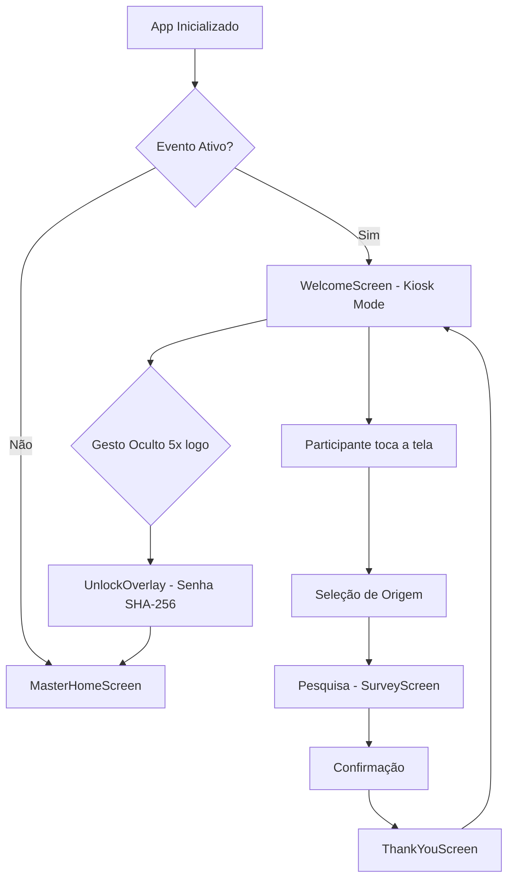

# Feedloop — Totem Edition


Sistema de coleta de feedback anônimo para eventos corporativos, projetado para operar em totens Android em modo kiosk, completamente offline, com geração de insights via IA local.

---

## Descrição

O **Feedloop — Totem Edition** resolve um problema recorrente em grandes eventos corporativos (SeniorTec, Universo TOTVS, Senior Experience, CONARH): a ausência de um canal eficiente para capturar demandas, expectativas e percepções de clientes, vendedores e usuários em tempo real.

O feedback se perde em conversas informais ou pesquisas enviadas por e-mail dias depois. O Feedloop coleta esse feedback no momento certo — durante o evento — de forma anônima, segura e sem dependência de internet.

**Dois perfis de uso:**
- **Participante (Kiosk Mode):** Interface travada, simples e intuitiva para responder pesquisas em totens
- **Master (Admin Mode):** Acesso protegido por senha para configurar eventos, visualizar feedbacks, gerar insights e exportar dados

---

## Tecnologias

| Tecnologia | Versão | Uso |
|---|---|---|
| Flutter | 3.x | Framework principal |
| Dart | ^3.11.1 | Linguagem |
| sqflite | ^2.3.0 | Banco de dados SQLite local |
| provider | ^6.1.0 | Gerenciamento de estado |
| crypto | ^3.0.3 | Hash SHA-256 para senhas |
| intl | ^0.19.0 | Formatação de datas |
| share_plus | ^9.0.0 | Exportação e compartilhamento |
| csv | ^6.0.0 | Geração de arquivos CSV |
| path_provider | ^2.1.0 | Acesso ao sistema de arquivos |

---

## Arquitetura

O projeto segue arquitetura em três camadas com separação clara de responsabilidades:

```
┌─────────────────────────────────────────┐
│           Presentation Layer            │
│  (Kiosk Screens + Master Screens)       │
├─────────────────────────────────────────┤
│            Business Layer               │
│     (Providers + Services + IA)         │
├─────────────────────────────────────────┤
│             Data Layer                  │
│        (SQLite + DAOs + Models)         │
└─────────────────────────────────────────┘
```

### Estrutura de Pastas

```
lib/
├── app/
│   ├── app.dart              # Widget raiz da aplicação
│   ├── routes.dart           # Definição de rotas
│   └── theme.dart            # Design system / Material 3
├── core/
│   ├── database/             # Configuração SQLite e migrations
│   ├── models/               # Modelos de dados
│   ├── providers/            # EventProvider, FeedbackProvider, InsightsProvider, KioskProvider
│   └── services/             # AiInsightService, ExportService, KioskService
├── features/
│   ├── kiosk/                # WelcomeScreen, OrigemSelectionScreen, SurveyScreen
│   ├── master/               # MasterHomeScreen, DemandListScreen, InsightsScreen
│   └── unlock/               # UnlockOverlay (gesto oculto + senha)
├── shared/
│   └── widgets/              # DemandCard, InsightCard, OriginBadge, StatusBadge
└── main.dart
```

### Diagrama de Fluxo



### Fluxo de Dados

```
User Input → Screen → Provider → Service → DAO → SQLite
                ↓
         UI Update ← Provider ← Service ← DAO ← SQLite
```

---

## Como Executar

### Pré-requisitos

- Flutter SDK `^3.11.1`
- Dart SDK `^3.11.1` (incluído no Flutter)
- Android Studio ou VS Code com extensão Flutter
- Dispositivo ou emulador Android 7.0+ (API 24+)
- Tablet 10"+ recomendado (orientação landscape)

### Instalação

```bash
# 1. Clonar o repositório
git clone https://github.com/biel1993ph/projeto-avaliativo-m12-feedloop.git
cd projeto-avaliativo-m12-feedloop

# 2. Instalar dependências
flutter pub get

# 3. Verificar análise estática
dart analyze
```

### Execução

```bash
# Executar em dispositivo/emulador conectado
flutter run

# Executar em modo release (recomendado para totens)
flutter run --release

# Build APK para instalação em totem
flutter build apk --release
```

---

## Exemplos de Uso

### Cenário 1 — Configuração de Evento (Master)

1. Abrir o app — usar gesto oculto (5 toques no logo) + senha padrão
2. Tocar em "Configurar Evento"
3. Preencher nome do evento, data e senha master
4. Adicionar perguntas personalizadas
5. Salvar — evento ativado automaticamente
6. Tocar em "Ativar Kiosk" para travar no modo totem

### Cenário 2 — Coleta de Feedback (Participante)

**Entrada:**
- Participante toca a tela na WelcomeScreen
- Seleciona origem: Cliente
- Responde às perguntas configuradas

**Saída:**
- Feedback salvo anonimamente no SQLite local
- ThankYouScreen exibida por 3 segundos
- Retorno automático à WelcomeScreen

### Cenário 3 — Exportação de Dados

**Exemplo de saída CSV:**
```csv
evento,data,origem,pergunta,resposta
SeniorTec 2026,2026-05-27,Cliente,Como avalia o atendimento?,Muito bom
SeniorTec 2026,2026-05-27,Vendedor,Principal demanda dos clientes?,Integração com ERP
```

---

## Autor

**Gabriel Da Silva**
Projeto Avaliativo — Módulo 12

- GitHub: [@biel1993ph](https://github.com/biel1993ph)
